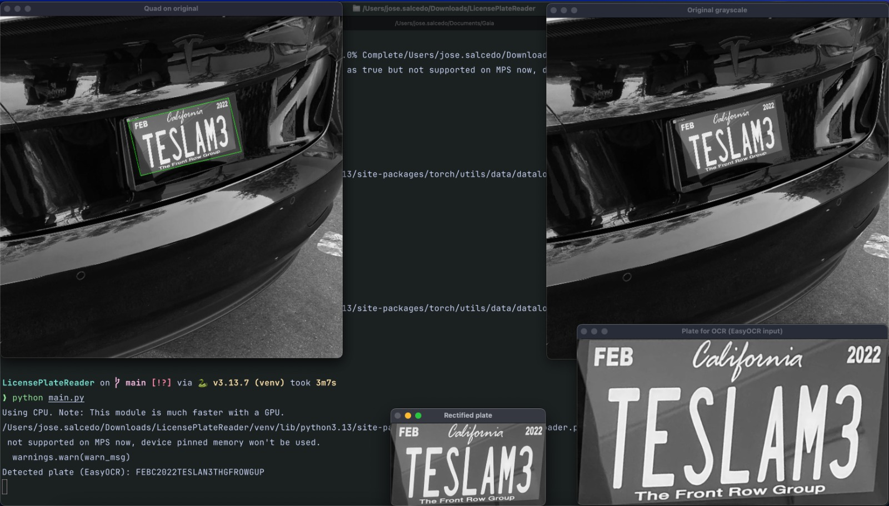
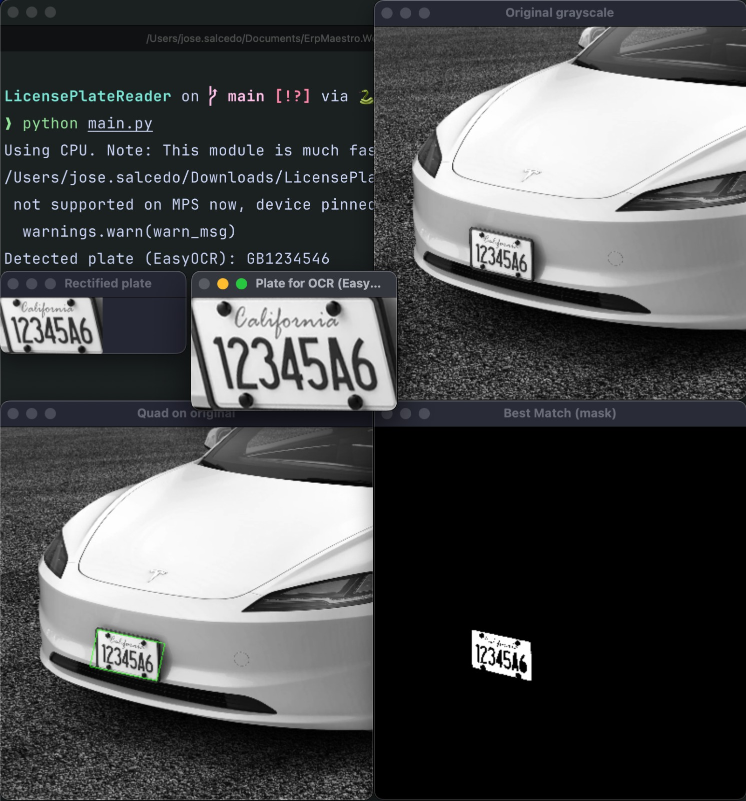
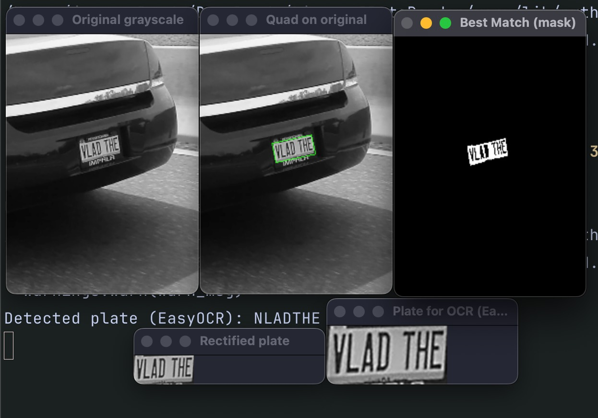

| |
|:--:|
|  |
| **Ingeniería en Sistemas y Gráficos Computacionales** |
| **Técnicas de Interpretación Avanzadas** |
| **Profesor: José Abdón Ramirez Ruiz** |
| **Equipo 10** |
| **José Salcedo Uribe** |
| **Emiliano Hinojosa Guzmán** |
| **November 21, 2025** |

# **LICENSE PLATE RECOGNITION USING IMAGE PROCESSING AND OCR**

# **Table of Contents**

1. **Introduction**
2. **Theoretical Framework**
   2.1. Otsu Thresholding
   2.2. Connected Component Labeling (BFS)
   2.3. Convex Hull Computation
   2.4. Minimum-Area Rectangle (minAreaRect)
   2.5. Point Ordering Algorithm
   2.6. Perspective Warp / Homography
   2.7. Optical Character Recognition (EasyOCR)
3. **Flowchart**
4. **Pseudocode**
5. **Program**
   - Insert code screenshots here
6. **Development**
   6.1. Program Logic
   6.2. Program Usage
   6.3. Tools and Methods Used
   6.4. What Worked
   6.5. What Didn’t Work
7. **Conclusion**
8. **References (APA Format)**

---

# **1. Introduction**

This project implements a basic license plate detection and recognition system using image processing techniques and Optical Character Recognition (OCR).
The system locates the license plate region within an input image, extracts it using geometric analysis, rectifies the plate to reduce distortion, and finally uses EasyOCR to recognize the alphanumeric characters.

The project combines classical computer vision algorithms—thresholding, connected component analysis, convex hulls, and minimum-area rectangles—with machine learning–based OCR. The pipeline is designed to operate on real-world images where plates may appear at an angle, partially occluded, or under varying lighting conditions.

---

# **2. Theoretical Framework**

This section describes all algorithms used in the system. Each algorithm is presented as a subsection.

---

## **2.1. Otsu Thresholding (Global Thresholding Method)**

Otsu’s thresholding is an algorithm used to convert a grayscale image into a binary image by automatically selecting an optimal threshold.
The method analyzes the histogram of pixel intensities and searches for the threshold value that maximizes between-class variance:

* The image is assumed to contain two classes: foreground and background.
* For each possible threshold, the algorithm computes class probabilities and class means.
* The threshold that maximizes the between-class variance is selected.

This provides a robust binarization even under non-uniform brightness conditions.

---

## **2.2. Connected Component Labeling (Breadth-First Search)**

After thresholding, the system identifies continuous white regions using connected component labeling.
A **Breadth-First Search (BFS)** is applied:

* A pixel is selected as a seed.
* All connected neighbors (4-connected or 8-connected) of the same value are explored.
* Each connected region is stored as a *fragment* consisting of its pixel coordinates.

This is used to isolate candidate regions that may contain a license plate.

---

## **2.3. Convex Hull Computation**

For each fragment, its shape is refined by computing the convex hull using OpenCV’s `cv.convexHull`.
A convex hull is the smallest convex polygon that contains all points of a region.

Convex hulls help:

* Smooth irregular shapes.
* Estimate rectangularity.
* Provide a better approximation for region geometry.

The ratio of the fragment area to the convex hull area is later used as a **rectangularity score**, helping determine whether a fragment resembles a license plate.

---

## **2.4. Minimum-Area Rectangle (minAreaRect)**

OpenCV’s `cv.minAreaRect` computes the smallest-area rotated rectangle that encloses a set of points.

From each fragment we compute:

* Center of the rectangle
* Width and height
* Rotation angle
* Four corner points (using `cv.boxPoints`)

This rectangle approximates the plate’s location and orientation even when the plate appears tilted or skewed in the image.

---

## **2.5. Point Ordering Algorithm**

The four rectangle vertices must be ordered consistently to compute a correct perspective transform.
The ordering used is:

1. Top-left
2. Top-right
3. Bottom-right
4. Bottom-left

This is achieved by comparing:

* The sum of coordinates → identifies TL and BR
* The difference of coordinates → identifies TR and BL

This ordering is crucial to avoid distortions when rectifying the plate.

---

## **2.6. Perspective Warp / Homography**

To “unskew” the plate, a **homography matrix** is estimated using the ordered quad and a target rectangle.

OpenCV’s `cv.getPerspectiveTransform` computes a 3×3 matrix **H**, and
`cv.warpPerspective` uses this matrix to project the quadrilateral region into a front-facing, axis-aligned rectangle.

This step eliminates:

* Tilt
* Perspective distortion
* Skew
* Rotational misalignment

The result is a clean, rectified plate image suitable for OCR.

---

## **2.7. Optical Character Recognition (EasyOCR)**

EasyOCR is a deep learning OCR engine based on:

* Convolutional Neural Networks (CNNs)
* LSTM-based sequence modeling
* CTC (Connectionist Temporal Classification) decoding

In this project, EasyOCR reads alphanumeric characters of the rectified plate.

Before OCR:

* The image is converted to grayscale
* Upscaled to increase text clarity
* Converted to a 3-channel image
* Restricted to `A–Z` and `0–9` allowlist

EasyOCR outputs the detected character sequence, which is post-processed to remove noise and convert it to uppercase.

---

# **3. Flowchart**

```
             +---------------------------+
             |       Load Image          |
             +-------------+-------------+
                           |
                           v
             +---------------------------+
             |      Otsu Thresholding    |
             +-------------+-------------+
                           |
                           v
             +---------------------------+
             | Connected Component Label |
             +-------------+-------------+
                           |
                           v
             +---------------------------+
             |  Compute Convex Hulls     |
             +-------------+-------------+
                           |
                           v
             +---------------------------+
             | Score Fragments (Rect + AR)|
             +-------------+--------------+
                           |
                           v
           +-------------------------------+
           | Select Best Plate Candidate   |
           +---------------+---------------+
                           |
                           v
             +---------------------------+
             | minAreaRect → Quad Points |
             +-------------+-------------+
                           |
                           v
           +-------------------------------+
           | Perspective Warp (Rectify)    |
           +---------------+---------------+
                           |
                           v
             +---------------------------+
             |     EasyOCR Recognition   |
             +-------------+-------------+
                           |
                           v
             +---------------------------+
             |        Output Text        |
             +---------------------------+
```

---

# **4. Pseudocode**

```
FUNCTION main():
    image ← load_grayscale(image_path)
    binary ← otsu_threshold(image)

    fragments ← extract_connected_components(binary)

    best_fragment ← NULL
    best_score ← +∞

    FOR each fragment IN largest 10 fragments:
        contour ← find_contour(fragment)
        convex ← convex_hull(contour)

        rectangularity ← area(fragment) / area(convex)

        quad ← minAreaRect(fragment)
        aspect ← max(width(quad), height(quad)) /
                  min(width(quad), height(quad))

        score ← |1 - rectangularity| + 0.3 * |aspect - 4|

        IF score < best_score:
            best_score ← score
            best_fragment ← fragment

    quad ← minAreaRect(best_fragment)
    rectified ← warp_quad(image, quad)

    text, ocr_input ← easyocr_read(rectified)

    PRINT text
END FUNCTION
```

---

# **5. Program**

```python
# main.py
import ssl
ssl._create_default_https_context = ssl._create_unverified_context

import cv2 as cv
import numpy as np
import easyocr
import ImageUtils as iu

image_path = "./test_images/test3.jpg"

reader = easyocr.Reader(["en"], gpu=False)


def read_plate_text_easyocr(plate_img: np.ndarray) -> tuple[str, np.ndarray]:
    """
    Recognize license plate text using EasyOCR.

    The plate image is converted to grayscale, upscaled, converted to a
    3-channel image, and passed to EasyOCR with an alphanumeric allowlist.

    Args:
        plate_img: Rectified image region containing the license plate.

    Returns:
        A tuple (text, ocr_input) where:
            text: Detected alphanumeric plate string in uppercase.
            ocr_input: Image actually sent to EasyOCR for debugging.
    """
    if len(plate_img.shape) == 2:
        gray = plate_img
    else:
        gray = cv.cvtColor(plate_img, cv.COLOR_BGR2GRAY)

    h, w = gray.shape[:2]
    scale = 2
    gray_big = cv.resize(gray, (w * scale, h * scale), interpolation=cv.INTER_CUBIC)
    vis_img = cv.cvtColor(gray_big, cv.COLOR_GRAY2BGR)

    results = reader.readtext(
        vis_img,
        detail=0,
        paragraph=False,
        allowlist="ABCDEFGHIJKLMNOPQRSTUVWXYZ0123456789",
    )

    text = "".join(results)
    text = "".join(ch for ch in text if ch.isalnum()).upper()

    return text, vis_img


def main() -> None:
    """
    Detect a license plate in an image, rectify it, and read its text.

    The pipeline performs the following steps:
        1. Load and binarize the input image.
        2. Extract connected rectangular fragments.
        3. Choose the fragment that best matches a plate-like rectangle.
        4. Compute a minimum-area bounding quadrilateral and warp it.
        5. Run EasyOCR on the rectified plate region and print the result.
    """
    grayscale = cv.imread(image_path, cv.IMREAD_GRAYSCALE)
    if grayscale is None:
        print(f"Could not read image at {image_path}")
        return

    bin_image = iu.umbralization(grayscale)

    fragments = iu.extractFragments(bin_image, "rect")
    fragments = sorted(fragments, key=lambda f: f.size, reverse=True)

    best_score = float("inf")
    closest_match = None

    for fragment in fragments[:10]:
        if fragment.size < 500:
            continue

        bg = np.zeros(bin_image.shape, dtype=np.uint8)
        for y, x in fragment.coords:
            bg[y, x] = 255

        contours, hierarchy = cv.findContours(
            bg,
            cv.RETR_CCOMP,
            cv.CHAIN_APPROX_SIMPLE,
        )
        if not contours or hierarchy is None:
            continue

        fragment.edge = max(contours, key=cv.contourArea)

        filled = bg.copy()
        convex_wrapping = bg.copy()

        for i, cnt in enumerate(contours):
            hull = cv.convexHull(cnt)
            target = filled if hierarchy[0][i][3] != -1 else convex_wrapping
            cv.fillConvexPoly(target, hull, 255)

        area_object = float(cv.countNonZero(filled))
        area_convex = float(cv.countNonZero(convex_wrapping))
        if area_convex == 0:
            continue

        rect_ratio = area_object / area_convex
        rect_score = abs(1.0 - rect_ratio)

        quad = iu.quad_from_min_area_rect(fragment)
        w_a = np.linalg.norm(quad[1] - quad[0])
        h_a = np.linalg.norm(quad[3] - quad[0])
        if h_a == 0:
            continue
        aspect = max(w_a, h_a) / min(w_a, h_a)

        target_aspect = 4.0
        aspect_score = abs(aspect - target_aspect)

        score = rect_score + 0.3 * aspect_score

        if score < best_score:
            best_score = score
            closest_match = fragment

    if closest_match is not None:
        mask = np.zeros_like(bin_image)
        for y, x in closest_match.coords:
            mask[y, x] = 255
        iu.showScaledImage("Best Match (mask)", mask, 3)

        quad = iu.quad_from_min_area_rect(closest_match)
        color = cv.cvtColor(grayscale, cv.COLOR_GRAY2BGR)
        quad_int = quad.astype(int)
        cv.polylines(color, [quad_int], isClosed=True, color=(0, 255, 0), thickness=2)
        iu.showScaledImage("Quad on original", color, 3)

        rectified, _ = iu.warp_quad(grayscale, quad, enforce_ratio=None)
        iu.showScaledImage("Rectified plate", rectified, 2)

        plate_text, ocr_input = read_plate_text_easyocr(rectified)
        iu.showScaledImage("Plate for OCR (EasyOCR input)", ocr_input, 2)

        print("Detected plate (EasyOCR):", plate_text)
    else:
        print("No suitable rectangular fragment (plate candidate) found.")

    iu.showScaledImage("Original grayscale", grayscale, 3)
    cv.waitKey(0)
    cv.destroyAllWindows()


if __name__ == "__main__":
    main()

# imageUtils.py
import cv2 as cv
import numpy as np
from numpy.typing import NDArray
from typing import Literal, Tuple, List
from collections import deque

Image = NDArray[np.uint8]


def umbralization(img: Image) -> Image:
    """
    Compute a binary image using Otsu-like global thresholding.

    The function estimates an intensity threshold that maximizes the
    between-class variance of foreground and background, then returns
    a binary image where pixels above the threshold are set to 255 and
    those below are set to 0.

    Args:
        img: Grayscale input image.

    Returns:
        Binary image with values in {0, 255}.
    """
    values = img.ravel()

    L = int(values.max()) + 1

    histogram = [0] * L
    for v in values:
        histogram[v] += 1

    N = len(values)
    p = [h / N for h in histogram]

    muT = sum(i * p[i] for i in range(L))

    w0 = 0.0
    mu0 = 0.0
    best_t = 0
    best_sigma = -1.0

    for t in range(L - 1):
        w0 += p[t]
        mu0 += t * p[t]
        w1 = 1.0 - w0
        if w0 == 0.0 or w1 == 0.0:
            continue

        num = muT * w0 - mu0
        sigma = (num * num) / (w0 * w1)

        if sigma > best_sigma:
            best_sigma = sigma
            best_t = t

    return np.where(img > best_t, 255, 0).astype(np.uint8)


class fragment:
    """
    Connected-component fragment representation.

    Attributes:
        edge: Contour of the fragment as returned by OpenCV, if available.
        coords: List of pixel coordinates (row, col) belonging to the fragment.
        size: Number of pixels in the fragment.
    """

    def __init__(self) -> None:
        self.edge: np.ndarray
        self.coords: List[Tuple[int, int]] = []
        self.size: int = 0


def extractFragments(image: Image, mask_type: Literal["cross", "rect"]) -> List[fragment]:
    """
    Find connected white regions in a binary image and return them as fragments.

    Breadth-first search is used to group 8-connected or 4-connected pixels
    depending on the selected mask type.

    Args:
        image: Binary input image with values in {0, 255}.
        mask_type: Neighborhood type used for connectivity. "cross" uses
            a 4-neighborhood; "rect" uses an 8-neighborhood.

    Returns:
        List of fragment objects, one per connected component.
    """
    fragments: List[fragment] = []
    h, w = image.shape[:2]
    visited = np.zeros((h, w), dtype=bool)
    mask = [(0, 0)]

    match mask_type:
        case "cross":
            mask = [(0, -1), (-1, 0), (1, 0), (0, 1)]
        case "rect":
            mask = [
                (-1, -1), (0, -1), (1, -1),
                (-1, 0),            (1, 0),
                (-1, 1),  (0, 1),   (1, 1),
            ]

    for y0 in range(h):
        for x0 in range(w):
            if visited[y0, x0]:
                continue

            if image[y0, x0] == 0:
                visited[y0, x0] = True
                continue

            visited[y0, x0] = True

            f = fragment()
            dq = deque([(y0, x0)])

            while dq:
                y, x = dq.popleft()
                f.coords.append((y, x))

                for dx, dy in mask:
                    ny, nx = y + dy, x + dx

                    if (
                        0 <= nx < w
                        and 0 <= ny < h
                        and not visited[ny, nx]
                        and image[ny, nx] == 255
                    ):
                        visited[ny, nx] = True
                        dq.append((ny, nx))

            f.size = len(f.coords)
            fragments.append(f)

    return fragments


def order_points(pts: np.ndarray) -> np.ndarray:
    """
    Order four points into a consistent rectangle vertex order.

    The returned order is:
    top-left, top-right, bottom-right, bottom-left.

    Args:
        pts: Array of shape (4, 2) with (x, y) coordinates.

    Returns:
        Array of shape (4, 2) with points ordered as TL, TR, BR, BL.
    """
    pts = np.asarray(pts, dtype=np.float32)

    s = pts.sum(axis=1)
    d = np.diff(pts, axis=1)

    tl = pts[np.argmin(s)]
    br = pts[np.argmax(s)]
    tr = pts[np.argmin(d)]
    bl = pts[np.argmax(d)]

    return np.array([tl, tr, br, bl], dtype=np.float32)


def quad_from_min_area_rect(frag: fragment) -> np.ndarray:
    """
    Compute the minimum-area rotated rectangle enclosing a fragment.

    If a contour is available in `frag.edge`, it is used. Otherwise, the
    rectangle is computed from the fragment's pixel coordinates.

    Args:
        frag: Fragment instance containing either a contour or a list of
            pixel coordinates.

    Returns:
        Array of shape (4, 2) with rectangle corners ordered as
        top-left, top-right, bottom-right, bottom-left.
    """
    if hasattr(frag, "edge") and frag.edge is not None:
        pts = frag.edge.reshape(-1, 2).astype(np.float32)
    else:
        pts = np.array([(x, y) for (y, x) in frag.coords], dtype=np.float32)

    rect = cv.minAreaRect(pts)
    box = cv.boxPoints(rect)
    quad = order_points(box)

    return quad


def warp_quad(
    image: Image,
    quad: np.ndarray,
    enforce_ratio: float | None = None,
) -> tuple[Image, np.ndarray]:
    """
    Warp a quadrilateral region into an axis-aligned rectangle.

    Args:
        image: Input image.
        quad: Array of shape (4, 2) with quadrilateral points ordered
            as top-left, top-right, bottom-right, bottom-left.
        enforce_ratio: If None, the output aspect ratio is determined
            by the quadrilateral geometry. If a positive float is given,
            the output height is adjusted so that width / height is close
            to this value.

    Returns:
        A tuple (warped, H) where:
            warped: Rectified image patch.
            H: 3×3 homography used for the perspective transform.
    """
    quad = np.asarray(quad, dtype=np.float32)
    tl, tr, br, bl = quad

    width_a = np.linalg.norm(br - bl)
    width_b = np.linalg.norm(tr - tl)
    max_width = int(np.ceil(max(width_a, width_b)))

    height_a = np.linalg.norm(tr - br)
    height_b = np.linalg.norm(tl - bl)
    max_height = int(np.ceil(max(height_a, height_b)))

    if max_width <= 0 or max_height <= 0:
        raise ValueError("Invalid quad dimensions for warp.")

    if enforce_ratio is not None and enforce_ratio > 0:
        max_height = max(1, int(round(max_width / enforce_ratio)))

    dst = np.array(
        [
            [0, 0],
            [max_width - 1, 0],
            [max_width - 1, max_height - 1],
            [0, max_height - 1],
        ],
        dtype=np.float32,
    )

    H = cv.getPerspectiveTransform(quad, dst)
    warped = cv.warpPerspective(
        image,
        H,
        (max_width, max_height),
        flags=cv.INTER_CUBIC,
        borderMode=cv.BORDER_REPLICATE,
    )

    return warped.astype(np.uint8), H


def showScaledImage(name: str, image: Image, scale: float | int) -> None:
    """
    Display an image resized by a given scale factor.

    Args:
        name: Window name.
        image: Input image.
        scale: If a float < 1, the image is scaled by that factor.
            If an integer, the image is downscaled by that integer divisor.
    """
    h, w = image.shape[:2]

    if isinstance(scale, float) and scale < 1:
        new_w = int(w * scale)
        new_h = int(h * scale)
    else:
        new_w = max(1, w // int(scale))
        new_h = max(1, h // int(scale))

    resized = cv.resize(image, (new_w, new_h))
    cv.imshow(name, resized)
```





---

# **6. Development**

This project was developed incrementally, starting from image preprocessing and ending with OCR.

### **6.1. Logic of the Program**

The main logic follows these steps:

1. **Load & Preprocess Image**
   Convert the input to grayscale and binarize using Otsu thresholding.

2. **Fragment Extraction**
   BFS-based connected components identify white regions that may correspond to the plate.

3. **Geometric Filtering**
   Each fragment is compared to a rectangle by:

   * Area ratio (fragment vs convex hull)
   * Aspect ratio close to ~4:1
     The most plate-like fragment is selected.

4. **Rectangle Fitting**
   `minAreaRect` estimates the orientation and boundary of the plate.

5. **Perspective Rectification**
   The skewed quadrilateral is transformed into an upright rectangle.

6. **OCR**
   EasyOCR reads the characters. The allowlist ensures only valid characters are returned.

### **6.2. Program Usage**
1. Load an image of a plate you want into the root of the project (where `main.py` is) and name the image file with whatever name you want (e.g. `my_image.jpeg`)
2. On line 9 of main.py you can change the image path to the name of your image with it's extension
```python
image_path = "my_image.jpeg"
```
3. Create a terminal on the root of the project and run the following command to install all dependencies:
```bash
pip install easyocr matplotlib numpy opencv-python
```
4. After installing the dependencies, run the program:
```bash
python main.py
```

---

### **6.3. Tools and Methods Used**

| Component                | Why it was used                          |
| ------------------------ | ---------------------------------------- |
| Otsu Thresholding        | Automatic and robust binarization        |
| BFS Connected Components | Simple and effective region segmentation |
| Convex Hull              | Helps estimate rectangularity            |
| minAreaRect              | Detects rotated bounding boxes           |
| Homography Warp          | Removes perspective distortion           |
| EasyOCR                  | Fast and accurate text recognition       |

---

### **6.4. What Worked**

* Fragment extraction reliably isolated the plate region.
* `minAreaRect` provided good alignment even on skewed plates.
* EasyOCR achieved readable results on clean rectified images.

### **6.5. What Didn’t Work Initially**

* Perspective warping produced squashed images until quad ordering was fixed.
* Tesseract OCR performed poorly; switching to EasyOCR solved this.
* SSL certificate issues prevented model downloads on macOS; manual downloading fixed it.

---

# **7. Conclusion**

This project successfully implemented a complete license plate recognition system using classical image processing and modern OCR. It can detect plate regions, correct geometric distortions, and identify alphanumeric characters.

What we accomplished:

* Automated plate region detection
* Rectification using homography
* OCR with EasyOCR

What we would have liked to add:

* A dataset-based evaluation
* Better handling of low-light or blurred images
* Image de-skewing still has some quirks to it, yielding weird results when the angle is really acute
* Given the time restrictions on this project; getting it to be really accurate was not possible. So improving accuracy is the main focus on what I would have focused if we kept working on the project

The project provided valuable experience in integrating traditional computer vision with neural network models, debugging OpenCV transformations, and handling real-world OCR challenges.

---

# **References (APA)**

Otsu, N. (1979). *A threshold selection method from gray-level histograms*. IEEE Transactions on Systems, Man, and Cybernetics, 9(1), 62–66.

Suzuki, S., & Abe, K. (1985). *Topological structural analysis of digitized binary images by border following*. Computer Vision, Graphics, and Image Processing, 30(1), 32–46.

OpenCV Documentation. (2024). *Image processing and transformation functions*. [https://docs.opencv.org/](https://docs.opencv.org/)

JaidedAI. (2020). *EasyOCR*. GitHub Repository. [https://github.com/JaidedAI/EasyOCR](https://github.com/JaidedAI/EasyOCR)

Bradski, G. (2000). *The OpenCV Library*. Dr. Dobb’s Journal.
